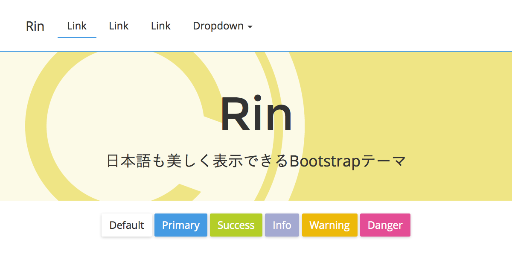

# Rin

[](https://travis-ci.org/Ichizz/Rin)
[](https://ci.appveyor.com/project/raryosu/rin/branch/master)
[](https://david-dm.org/Ichizz/Rin#info=devDependencies)
[](LICENSE)

[http://v4-alpha.rinhoshizo.la/](https://v4-alpha.rinhoshizo.la/)

[](http://rinhoshizo.la/)

"Rin" は "Honoka" を元にした日本語も美しく表示できる Bootstrap テーマです。

## About "Rin"

通常の [Bootstrap](http://getbootstrap.com/) では、日本語の表示が最適であるとはいえません。 "Rin" では Bootstrap をベースに、日本語表示に適したフォントの指定や、ウェイトに関するコードを追記した Bootstrap テーマです。

## Live Demo

 * [http://rinhoshizo.la/bootstrap.html](https://v4-alpha.rinhoshizo.la/bootstrap.html)

## Getting Started

### Download

[Releases](https://github.com/Ichizz/Rin/releases) ページから最新版をダウンロードしてください。

### Bower

[Bower](http://bower.io/) からインストールすることができます。

最新版をインストールするには以下のコマンドを実行してください。

```
bower install --save-dev $(node -e "$(curl -fsSL https://cdn.honokak.osaka/last.js)" raryosu Rin)
```

もしcURLが入っていない環境の場合には、

```
bower install --save-dev Rin#(version)
```

``(version)`` には Honoka のバージョン番号を指定します(ex. ``Rin#.4.1-1``)。Rinの最新バージョン番号は[Releases](https://github.com/Ichizz/Rin/releases) ページから確認してください。

## Usage

Rinは単なるBootstrap のテーマにしか過ぎないため、基本的な使い方は本家Bootstrapとほとんど変わりません。よって以下に書くことは[本家Bootstrap](http://getbootstrap.com/getting-started/)からの引用，もしくはその一部を変更したものです。用意されたCSSクラスやコンポーネントなど，より詳細な使い方のドキュメントは本家Bootstrapの各種リファレンスページをご覧になることを推奨します。

 * [CSS](http://getbootstrap.com/css/)
 * [Components](http://getbootstrap.com/components/)
 * [JavaScript](http://getbootstrap.com/javascript/)

### Package

配布している ZIP ファイルの内容物は以下のとおりです。 `bootstrap.min.css` といったように、ファイル名に `min` がついているファイルは、改行やインデント・スペーシングをなくした(minifyされた)コードで、ユーザがウェブページを読み込む際の転送量を少なくすることができます。通常はこの `bootstrap.min.*` を使うことをおすすめします。

```
honoka/
├─ LICENSE
├─ README.md
├─ bootstrap.html
├─ css/
│  ├─ bootstrap.css
│  └─ bootstrap.min.css
└─ js/
    ├─ bootstrap.bundle.js
    ├─ bootstrap.bundle.min.js
    ├─ bootstrap.js
    └─ bootstrap.min.js
```

### Basic Template

Bootstrapをつかってウェブページを作成する際に基本となるHTML部分は以下のようになります。CSSやJavaScriptのファイルパスは環境に合わせて変更する必要があります。

```html
<!DOCTYPE html>
<html lang="ja">
  <head>
    <meta charset="utf-8">
    <meta http-equiv="X-UA-Compatible" content="IE=edge">
    <meta name="viewport" content="width=device-width, initial-scale=1">
    <!-- The above 3 meta tags *must* come first in the head; any other head content must come *after* these tags -->
    <title>Bootstrap 101 Template</title>

    <!-- Bootstrap -->
    <link href="css/bootstrap.min.css" rel="stylesheet">

    <!-- HTML5 shim and Respond.js for IE8 support of HTML5 elements and media queries -->
    <!-- WARNING: Respond.js doesn't work if you view the page via file:// -->
    <!--[if lt IE 9]>
      <script src="https://oss.maxcdn.com/html5shiv/3.7.3/html5shiv.min.js"></script>
      <script src="https://oss.maxcdn.com/respond/1.4.2/respond.min.js"></script>
    <![endif]-->
  </head>
  <body>
    <h1>Hello, world!</h1>

    <!-- jQuery (necessary for Bootstrap's JavaScript plugins) -->
    <script src="https://ajax.googleapis.com/ajax/libs/jquery/1.12.4/jquery.min.js"></script>
    <!-- Include all compiled plugins (below), or include individual files as needed -->
    <script src="js/bootstrap.min.js"></script>
  </body>
</html>
```

### Do you hate "YuGothic"?

もしあなたが日本語フォントに游ゴシックを指定したくない場合，その要素に対して``.no-thank-yu``(※``you``ではなく``yu``)を指定することで游ゴシックの指定はされなくなり，Windowsであればメイリオ，Mac OS Xであればヒラギノ角ゴを優先的に使用するようになります。

例えばページ全体に対して游ゴシックを用いたくない場合は，``<body>``に対して``.no-thank-yu``を指定(``<body class="no-thank-yu">``)することで，ページ全体で游ゴシックは使用されなくなります。

## Build

ビルドの方法については [Wiki](https://github.com/windyakin/Honoka/wiki) をご覧ください。

## License

[MIT License](LICENSE)

## Author of "Honoka"

* windyakin ([@MITLicense](https://twitter.com/MITLicense))

## Author of "Rin"

* Hagihara Ryosuke ([Raryosu.info](http://raryosu.info/))
